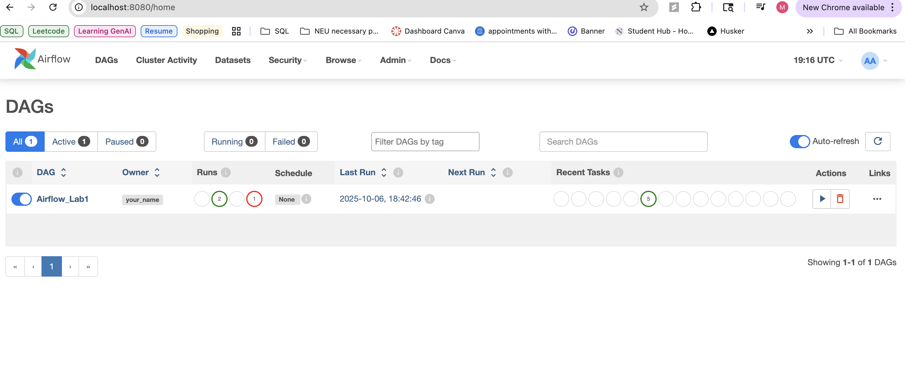
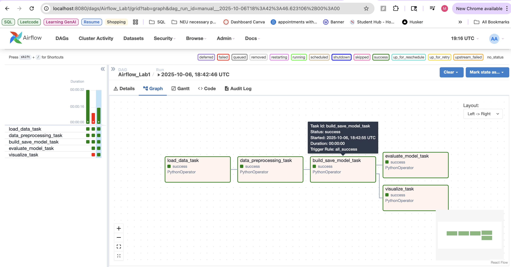
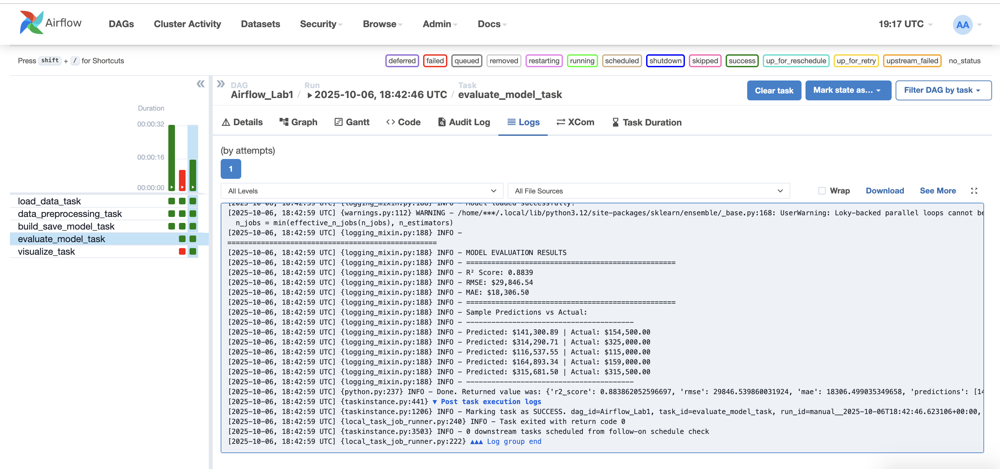
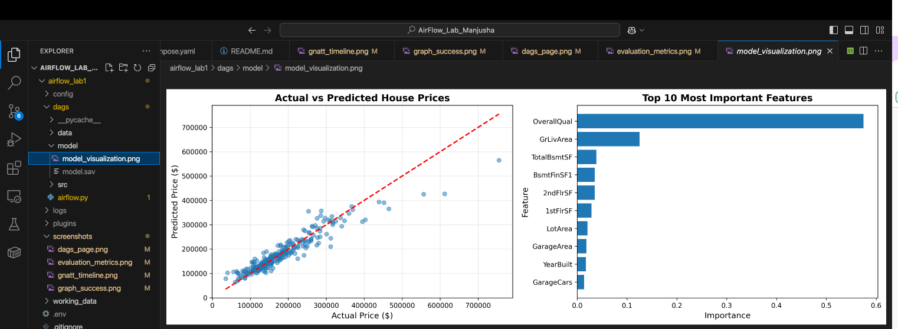

# Airflow Lab: House Price Prediction with Random Forest

Machine learning workflow using Apache Airflow to predict house prices with Random Forest Regression.

## Project Overview

Automated pipeline that:
1. Loads house price data
2. Preprocesses features and handles missing values
3. Trains Random Forest Regressor model
4. Evaluates performance (R², RMSE, MAE)
5. Generates visualizations

## Dataset

- **Source**: [Kaggle House Prices Dataset](https://www.kaggle.com/c/house-prices-advanced-regression-techniques/data)

## Setup

1. **Configure docker-compose.yaml**:
```yaml
_PIP_ADDITIONAL_REQUIREMENTS: ${_PIP_ADDITIONAL_REQUIREMENTS:- pandas scikit-learn kneed matplotlib}
```

2. **Start Airflow**:
```bash
docker compose up airflow-init
docker compose up -d
```

3. **Access UI**: http://localhost:8080 (login: airflow2/airflow2)



## Running the Pipeline

1. Click `Airflow_Lab1` DAG
2. Trigger manually (Play button)
3. Monitor in Graph view



## Workflow

```
load_data → preprocess → train_model → [evaluate, visualize]
```


## Results

View metrics in `evaluate_model_task` logs:
- R² Score: 0.85-0.90
- RMSE: $25,000-$35,000
- MAE: $15,000-$20,000



## Visualization

Generated at `dags/model/model_visualization.png`:
- Actual vs Predicted prices scatter plot
- Top 10 feature importance



View with:
```bash
open dags/model/model_visualization.png
```

## Stop Airflow

```bash
docker compose down
```